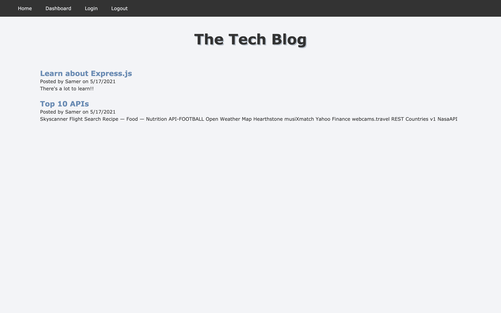
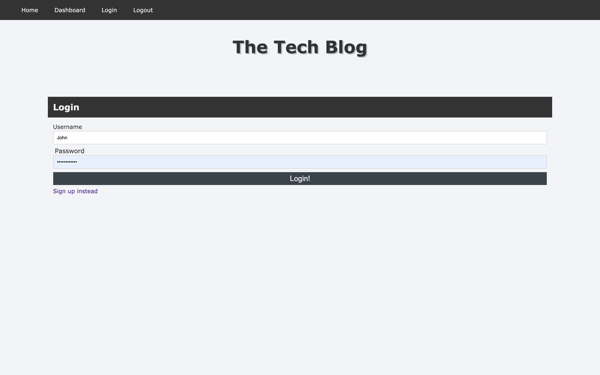

# Tech Blog

  
  
  

  ## Description 
  An application that builds a CMS-style blog site similar to a Wordpress site, where developers can publish their blog posts and comment on other developers’ posts as well. The app follows the MVC paradigm in its architectural structure, using Handlebars.js as the templating language, Sequelize as the ORM, and the express-session npm package for authentication.

  
  

  ## Table of Contents
  
  * [Links](#Links)
  * [Installation](#installation)
  * [Usage](#usage)
  * [License](#license) 
  * [Contributing](#contributing)
  * [Questions](#questions) 

  ## Links

  Visit the deployed application [here](https://nameless-anchorage-28410.herokuapp.com/)
  
  ## Installation
  1. Clone or download the repository
  1. Open console
  1. Run `npm install` to install dependencies
  
  ## Usage
    Write `npm run start` or `npm start` in console to start the application
  
## License
This application is covered under MIT License [More information about about the license](https://choosealicense.com/licenses/mit/)
  
  ## Contributing
  Please feel free to contribute by sending a pull request

  ## Questions
  Please feel free to reach out with any questions via [email](mailto:samersaemeldahr@gmail.com) or [GitHub](https://www.github.com/samersaemeldahr)